
# Hackthebox - Academy

First, I ran Nmap to scan for open ports.
Nmap results:
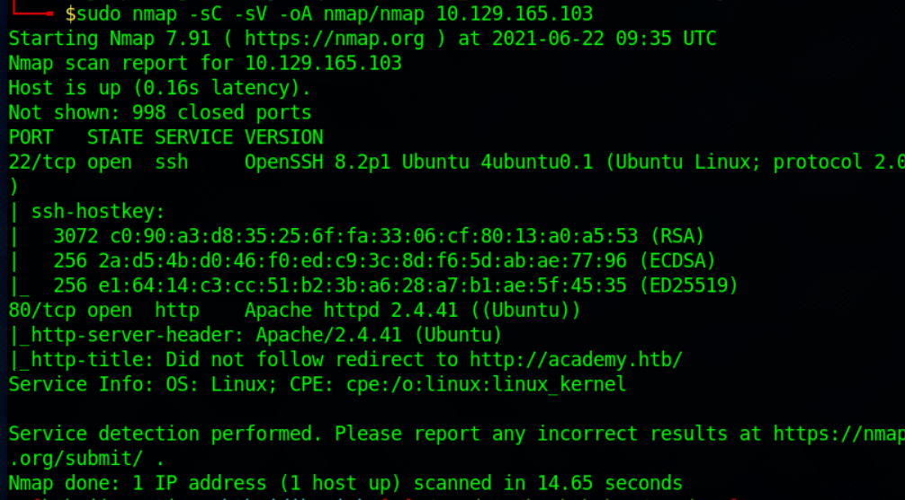

When opening the IP address on my browser, it redirects me to a host called **academy.htb**, so I added the domain to my hosts file.
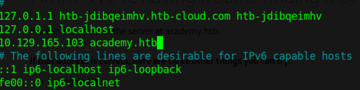

Opening **academy.htb** gives me this page.
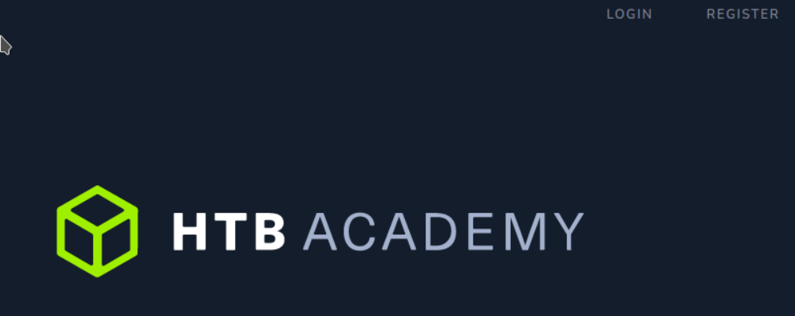

The websites uses php files based on the login and register link so I am starting a gobuster to search for directories and php files on the server.
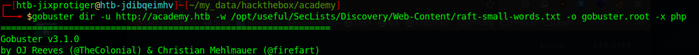

After trying weak credentials and SQL injection on login.php which didn't work, I go to register.php and view the source and found a hidden input type called role id.

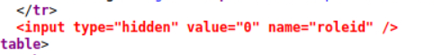

I changed the role id's value to 1 and register an account.
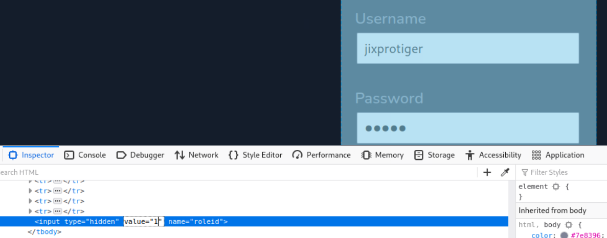

I try logging in through login.php, but the websites is just a static page which isn't really interesting. But gobuster tells me that there is a page called **admin.php**.
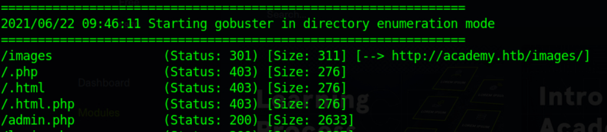

Opening the website gives me a login page. I can log in with the account I just registered. After logging in, it gives me this page which leaks a new host.

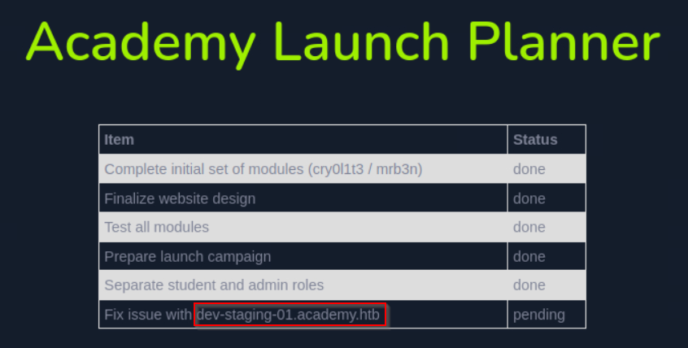

After adding it to my hosts file, I open the page and it just gives me an error page from Laravel which is a php framework for websites.
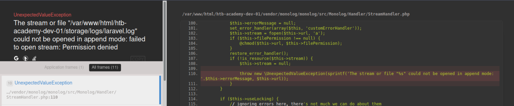

After Googling a bit, I find an exploit from metasploit (https://www.rapid7.com/db/modules/exploit/unix/http/laravel_token_unserialize_exec/) which uses the APP_KEY from the server and the error page leaks it so I decided to try this exploit.
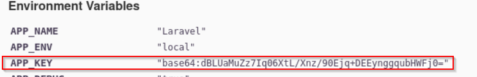

I ran the exploit and got a shell as **www-data**.
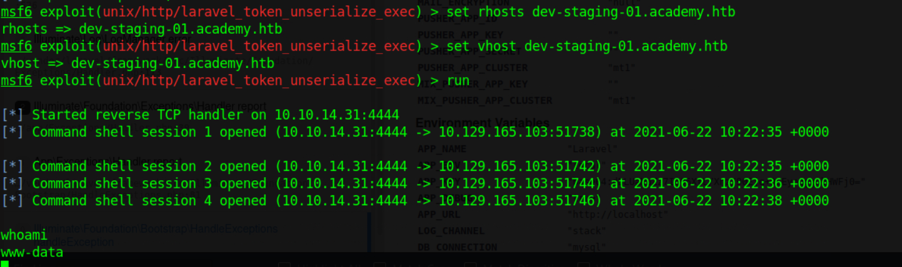

The shell from metasploit isnot persistent, so I spawn a new reverse shell using a bash command which is persistent.
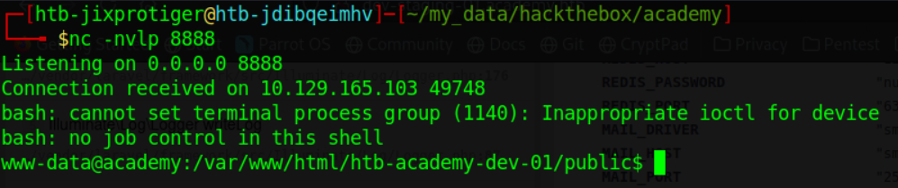

I found a 2 passwords running a grep command on the academy folder. 1 is plain text and 1 is a hash.
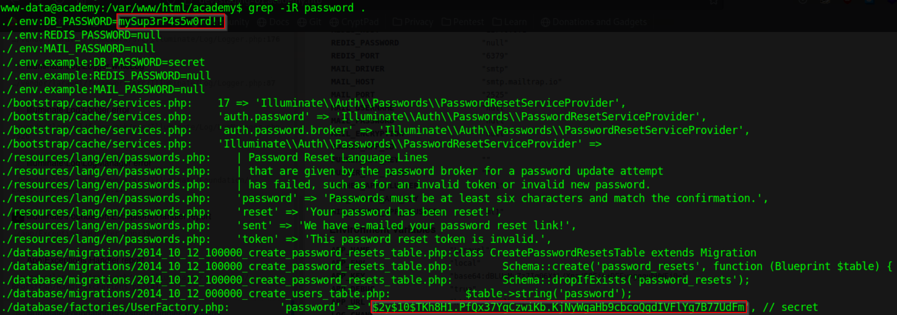

I cracked the hash with john and got the password is "secret".

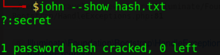

Looking at the **/home** directory, there are 6 users and I have 2 passwords and SSH is open on port 22. So I use Hydra to bruteforce ssh with the credenrtials I have and got 1 working credential from the user cry0l1t3.
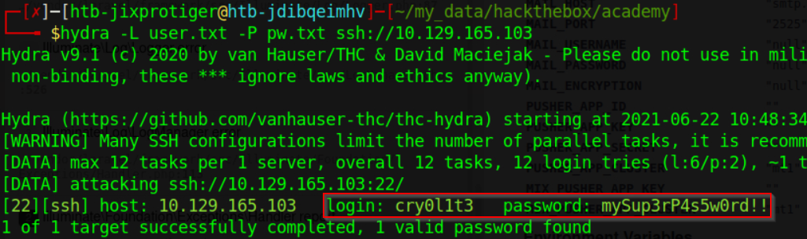

Now I can ssh with that credential and got the user flag.
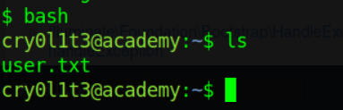

Next, I run linpeas (https://github.com/carlospolop/privilege-escalation-awesome-scripts-suite) to enumerate as the user.
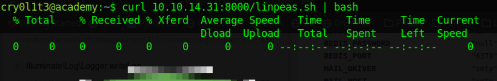

Looking through the output of linpeas, it tells me that the user is part of the adm group which is unusual. adm group can read files from **/var/log**.
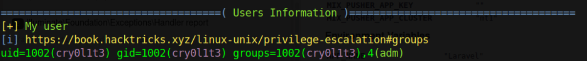

I use aureport which produces reports and summaries from the audit.log files. Using the **--tty** to see what is typed into the terminal and got a password for mrb3n.

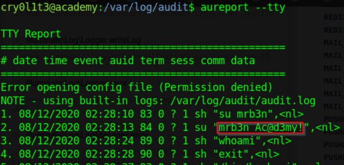

Running **sudo -l**  as mrb3n tells me that mrb3n can run composer as root.  So I go to gtfobins (https://gtfobins.github.io/gtfobins/composer/) and use the command from there.
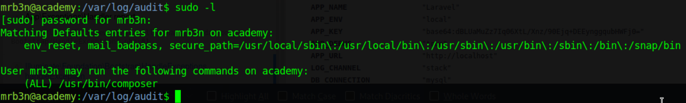

Running the commands and it spawns a shell as root.
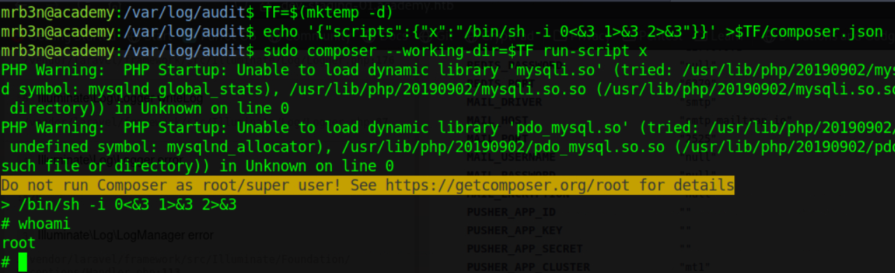
