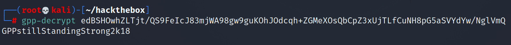

# Hackthebox - Active

FIrst I run Nmap to scan for open ports.
```bash
Nmap scan report for 10.10.10.100
Host is up (0.033s latency).
Not shown: 983 closed ports
PORT      STATE SERVICE       VERSION
53/tcp    open  domain        Microsoft DNS 6.1.7601 (1DB15D39) (Windows Server 2008 R2 SP1)
| dns-nsid: 
|_  bind.version: Microsoft DNS 6.1.7601 (1DB15D39)
88/tcp    open  kerberos-sec  Microsoft Windows Kerberos (server time: 2021-07-19 10:33:59Z)
135/tcp   open  msrpc         Microsoft Windows RPC
139/tcp   open  netbios-ssn   Microsoft Windows netbios-ssn
389/tcp   open  ldap          Microsoft Windows Active Directory LDAP (Domain: active.htb, Site: Default-First-Site-Name)
445/tcp   open  microsoft-ds?
464/tcp   open  kpasswd5?
593/tcp   open  ncacn_http    Microsoft Windows RPC over HTTP 1.0
636/tcp   open  tcpwrapped
3268/tcp  open  ldap          Microsoft Windows Active Directory LDAP (Domain: active.htb, Site: Default-First-Site-Name)
3269/tcp  open  tcpwrapped
49152/tcp open  msrpc         Microsoft Windows RPC
49153/tcp open  msrpc         Microsoft Windows RPC
49154/tcp open  msrpc         Microsoft Windows RPC
49155/tcp open  msrpc         Microsoft Windows RPC
49157/tcp open  ncacn_http    Microsoft Windows RPC over HTTP 1.0
49158/tcp open  msrpc         Microsoft Windows RPC
Service Info: Host: DC; OS: Windows; CPE: cpe:/o:microsoft:windows_server_2008:r2:sp1, cpe:/o:microsoft:windows

Host script results:
|_clock-skew: 1s
| smb2-security-mode: 
|   2.02: 
|_    Message signing enabled and required
| smb2-time: 
|   date: 2021-07-19T10:34:59
|_  start_date: 2021-07-19T04:46:05
```

LDAP leaks its hostname which is **active.htb** so I added it to my hosts file. Port 53 which is DNS is open so I use nslook up to get a bunch of information but didn't found anything interesting.


Next is SMB, I use smbmap to do an anonymous login and got a share named "Replication".


I use SMBClient to look around the share with anonymous login. After a while, I found a file called **Groups.xml**. I downloaded the file to my box and see its contents  and got an encrypted GPP password.


I use gpp-decrypt and got the password for the account **svc_tgs**.


After getting the svc_tgs credentials, I can log in to SMB and get the user flag. Next I try checking if there is any kerberoastable users in the box. I use impacket to do it and got a TGS (Ticket Granting Service) for the administrator.


The TGS contains the password for the accoutn so I just pass it to john adn cracked the password.


As I already got the credentials for administrator, I can just PSExec into the box and got a shell as administrator.
