<head>
  
</head>
<body>
 

# **HACKTHEBOX – ADMIRER WRITEUP**

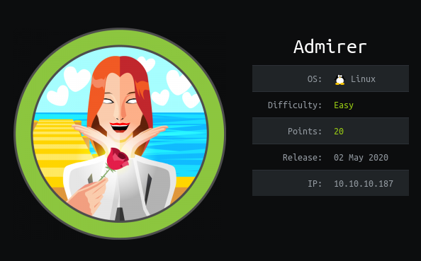

# **IP: 10.10.10.187**

# **ENUMERATION**

First, I am going to start nmap to scan for open ports.

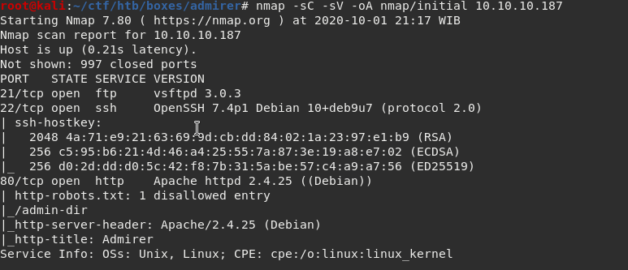

There are 3 open ports. Ftp, ssh and http. I am going to start with ftp first.

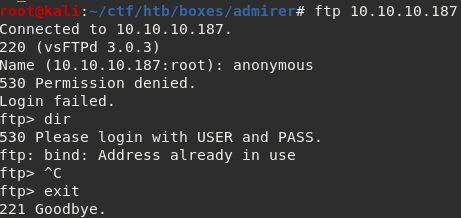

I tried anonymous login, but the login failed. So, until I got some credentials I will move on from ftp.

SSH has a narrow attack surface so I am going to enumerate the web server on port 80 first.

Opening the web page gives me a bunch of pages.

I try to go to &quot;robots.txt&quot; and it has some interesting things.

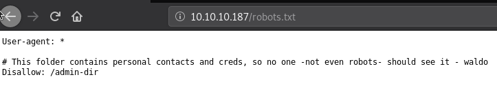

There is a directory called &quot;/admin-dir&quot;.

I try to go to index.php to see what files the web server are using, and &quot;index.php&quot; shows us the home page which means the server are using php files.

I will start a gobuster on the website to look for directories and hidden php files, I will also start a gobuster on the &quot;/admin-dir&quot; directory.

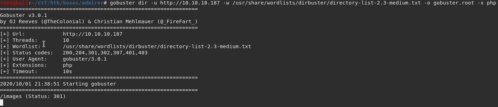

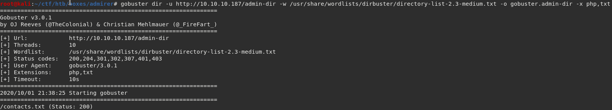

The gobuster on admin-dir directory shows us there is a contacts.txt files, that is very interesting.

Opening the file shows us a bunch of emails.

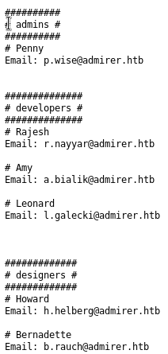

The robots.txt says there are contacts and creds in admin-dir, and we got a file called contacts.txt, so I am going to try creds.txt, and I got a 404.

Creds is a short way to say credentials, so I am going to try credentials.txt.

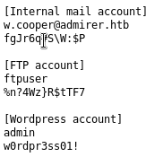

And we got some credentials. There is a wordpress account, so I am going to try to go to wp-login.php to see if there is a login page, but I got a 404.

After that, I tried the ftp account.

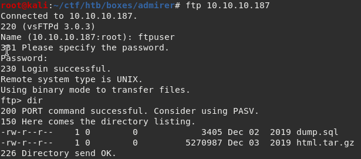

I got logged in and see that there are 2 files. I download both to be able to see their content.

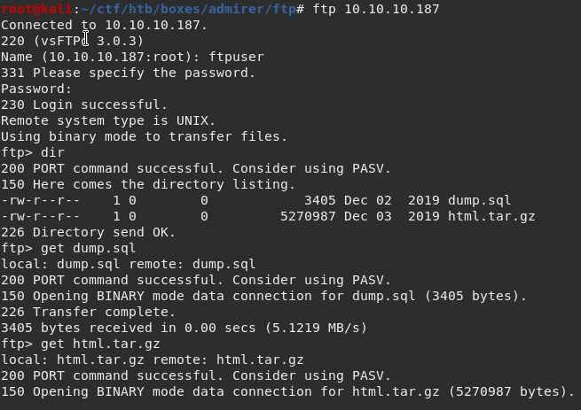

Seeing the index.php file, there is a credential.

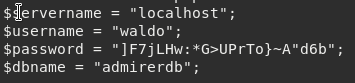

I try to SSH into the box, but the credential doesn&#39;t work.

Opening the contents of the dump.sql doesn&#39;t give any useful information.

Opening the utility-scripts folder gives us 4 php files.

Inside db\_admin.php, there is 1 more credential belonging to waldo, I try to SSH with that credential and it doesn&#39;t work.

Now, there is this utility-scripts folder in the web server, and according to hints on the HTB forum, I should start a new gobuster to look for more php files on that folder.

The usual wordlist doesn&#39;t found anything, so I use a wordlist from Seclists (https://github.com/danielmiessler/SecLists).

The gobuster found adminer.php, which is interesting.

I don&#39;t know a lot about adminer, so I google about it and found out that there is a file disclosure vulnerability, not only localhost ([https://sansec.io/research/adminer-4.6.2-file-disclosure-vulnerability](https://sansec.io/research/adminer-4.6.2-file-disclosure-vulnerability)).

We just need to make the adminer connect to us and use LOAD DATA LOCAL to load files from the machine.

The first time I try to execute the sql command, I got an error.

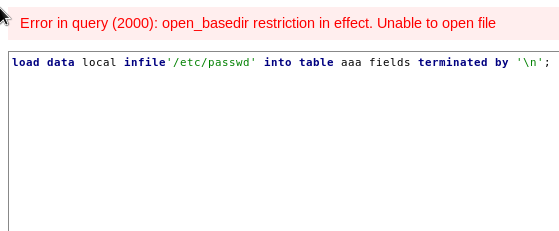

Turns out we can&#39;t access files that is outside a specific directory. Checking the info.php file, we can see that open\_basedir is set to &quot;/var/www/html&quot; only.

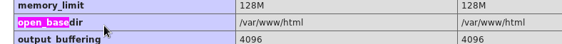

So I use /var/www/html/index.php file to see if my command works.

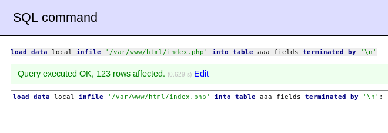

It worked, and when I open my &quot;aaa&quot; table it shows the index.php file.

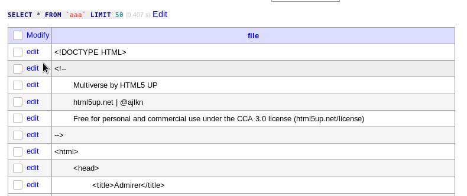

Inside the index.php file there is a new credential also belonging to waldo.

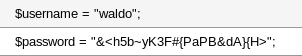

So I try ssh with that password and it worked!

# **ROOT**

I run sudo -l command and use the ssh password, it says that we can run the admin\_tasks.sh file, and we can do SETENV.

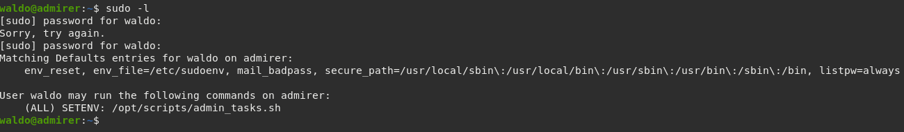

Checking the /opt/scripts directory there is a backup.py file.

It backups the content of /var/www/html directory and in admin\_tasks.sh file, the backup.py gets ran in the backup\_web function.

Which means, if we can make the python file do something malicious, we can get root because we can execute the admin\_tasks file as root and call the backup\_web function.

So I make a file called shutil.py because that is what the backup.py is importing in /dev/shm and put a reverse shell with nc in the make\_archive function.

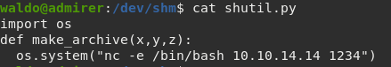

After that, just setup a listener and run the admin\_tasks file, choose option 6 to run the backup.py.

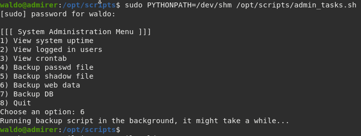

Wait for a few seconds, and we got root!

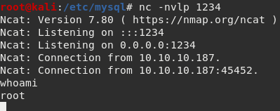

</body>
