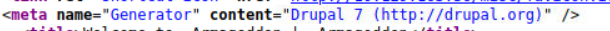
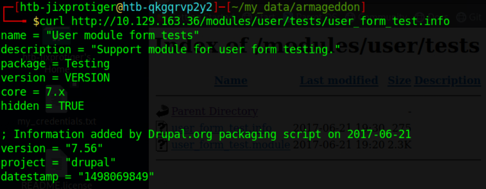

# Hackthebox - Armageddon

First, I run nmap to scan for open ports.
Nmap result:

Port 80 for HTTP is open, So I open the web page first.

Viewing the source page, we got the information that the page uses Drupal version 7.

I ran gobuster to look for hidden directories and also php files.

I get the specific version which is 7.56 after looking around and curling this info file.

I found a CVE and an exploit(CVE-2018-7600) for Drupal and version 7.56 is vulnerable.

I use metasploit to ran the exploit and got a meterpreter shell as the user apache.

Right now, I am a low privileged user and I need to privesc my way up. I try to look at config files and finally got some credentials from **/var/www/html/sites/default/settings.php**.

It looks like it was used for mysql, So i try to execute mysql commands using those credentials and it worked!

I tried to enumerate the drupal database using this command:

There is a table called users which is very interesting. I run a command to select everything from the table and got a little bit messy, so I just output columns that I wanted.

We got a hash of a password for the user brucetherealadmin which if you see in **/etc/passwd**, is a user. I use hashcat to crack the password hash.

I ssh in with the password and got the user flag.

Now trying to get root, I ran **sudo -l** and bruce can run a command with sudo with no password.

I find an exploit(https://github.com/initstring/dirty_sock) for the privesc. I use the **dirty_sockv2.py** as a reference.

The code above shows the python code where the exploit put the variable "TROJAN_SNAP" which is just a base64 encoded bash commands to add a user called "dirty_sock" to be able to run sudo on any command to a snap file. **More explanation here https://0xdf.gitlab.io/2019/02/13/playing-with-dirty-sock.html.**

So I decode the TROJAN_SNAP and put it to a file called "exploit.snap". install the snap file and we can switch to a user called "dirty_sock".

Running **sudo -l** on dirty_sock shows that we can use any command with sudo, and the password to sudo for dirty_sock is "dirty_sock". So I just pop up a bash with sudo and got the root flag.

