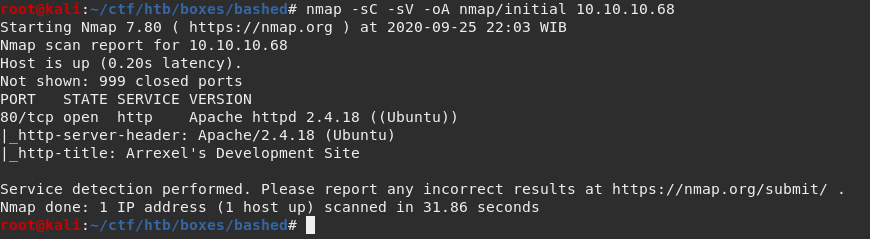
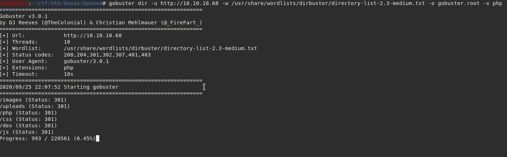
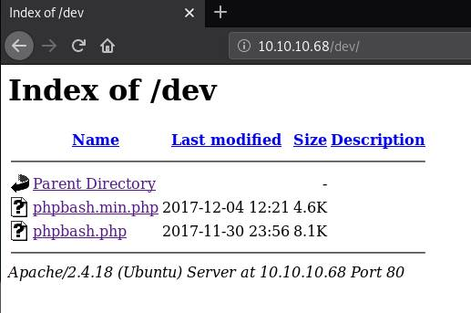
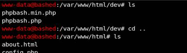
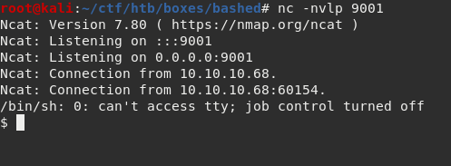
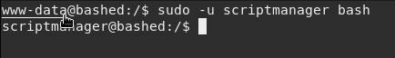
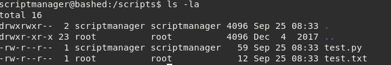
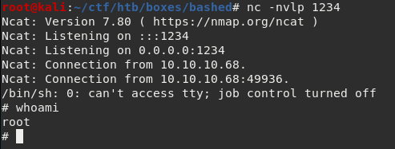

<html>
  <head>
    
  </head>
  <body>

# **HACKTHEBOX – BASHED WRITEUP**

# **IP: 10.10.10.68**

# **ENUMERATION**

First, we will run nmap to scan for open ports. The scan returns only port 80 is open.

Opening the web shows us a simple static website.

# **FOOTHOLD**

I try running gobuster against the website. Because the website says php so I throw an extension flag to try for php files.

It returns more hidden directories, and the most interesting is &quot;/dev&quot;.

Opening &quot;/dev&quot; gives us 2 php files. I try opening &quot;phpbash.php&quot;.

It gives us a shell, so I will try a reverse shell.

We got a shell!

# **USER**

Running the command &quot;sudo -l&quot; as www-data says that we can run as scriptmanager. So we can simply use scriptmanager to run bash to spawn a shell as scriptmanager.

# **ROOT**

After enumerating the box as scriptmanager, there is a directory called &quot;/scripts&quot; which is not default on linux. So I decided to take a look at it.

After running &quot;ls -la&quot;, There is a python script called &quot;test.py&quot; that is ran every minute as root, because it is writing to &quot;test.txt&quot; which is writable by root only. We can just modify &quot;test.py&quot; to something malicious and we can get root.

I decided to put a python reverse shell payload and setup a listener.

We got root!

</body>
</html>
