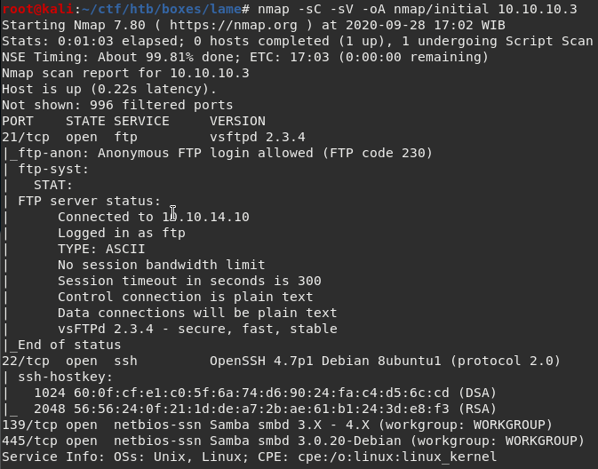
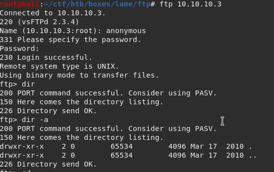
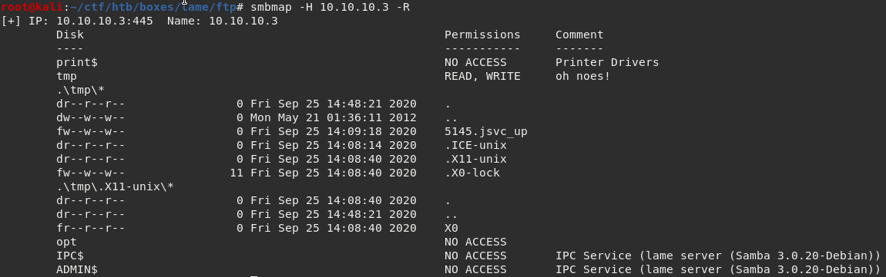
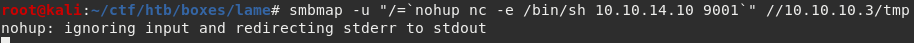
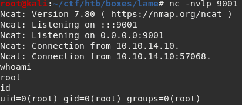

# **HACKTHEBOX – LAME WRITEUP**

# **IP: 10.10.10.3**

# **ENUMERATION**

First, we will run nmap to discover open ports.

We see 4 open ports.

I am going to start to poke around ftp first because nmap tells me that anonymous ftp login is allowed.

Use username &quot;anonymous&quot; and the password doesn&#39;t matter and we got logged in!

Using the command &quot;dir -a&quot; the directory is empty and we can&#39;t change directories.

We can&#39;t really attack ssh other than brute-forcing, so I am going to enumerate smb.

I use smbmap to list the smb shares and permissions.

# **ROOT**

Nothing really interesting other than the tmp folder that we can read and write.

So I turn to google for some exploits, turns out the smb service is vulnerable to CVE-2007-2447.

Based off reading this python script ([https://gist.github.com/joenorton8014/19aaa00e0088738fc429cff2669b9851](https://gist.github.com/joenorton8014/19aaa00e0088738fc429cff2669b9851)), we just need to insert the payload to the username field and we can execute commands.

So I use smbmap and use the &quot;-u&quot; flag and input the payload.

Setup a listener on my machine and send the payload.

We got root!

