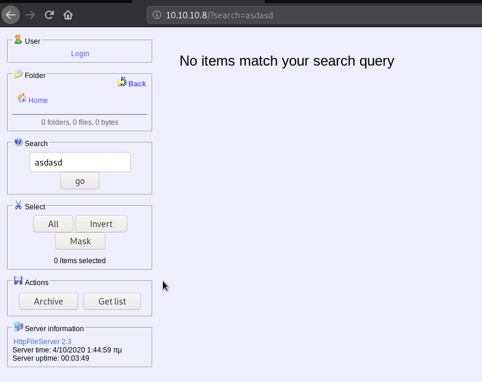

# **HACKTHEBOX – OPTIMUM WRITEUP**

# **IP: 10.10.10.8**

# **ENUMERATION**

First, I will run nmap to discover open ports.

Only 1 port is open. It is port 80 which is http means it is hosting a website and it is using HttpFileServer 2.3.

Opening the website gives us a default page.

# **FOOTHOLD**

So I am going to google an exploit for HttpFileServer 2.3 because that is the service we are dealing with right now. Some articles uses Metasploit which I am purposely avoiding.

Then I came to this exploit-db article ([https://www.exploit-db.com/exploits/34668](https://www.exploit-db.com/exploits/34668)).

The search parameter is vulnerable so I am going to Burpsuite Repeater to inject my command there.

Now the problem is, the server doesn&#39;t tell us wether the command is executed or not, so I am going to ping my box and do a tcpdump to see if the ping command actually ran.

If we got a ping back, we know for sure we got command execution.

URL encode it and click send.

Sadly it didn&#39;t work…

So I try using powershell. Just google windows powershell.exe location and put it on the payload.

URL encode it and click send.

It worked! The machine is pinging us back which means our command ran. So now we just need a reverse shell payload.

# **USER**

I will be using nishang&#39;s &quot;Invoke-PowerShellTcp.ps1&quot;.

Setup a simple python http server and download the powershell script to the target machine, then setup a listener on your machine.

URL encode it and click send.

Wait for a few seconds.

We got a shell as a user!

# **ROOT**

Now we need to enumerate this box. A script I like to use is Sherlock.ps1.

The script outputs vulnerabilities of the target machine. The very first one is MS16-032, so I am going with that.

I am going to use a script from Empire to exploit MS16-032.

I will tell the script to download a reverse shell script to port 9002 on my machine. Setup a listener and it didn&#39;t work for me the first time.

I keep getting an error.

I google the error and it keeps erroring out because I was using a 32-bit powershell. So I just switch to a 64-bit one and we got root!

