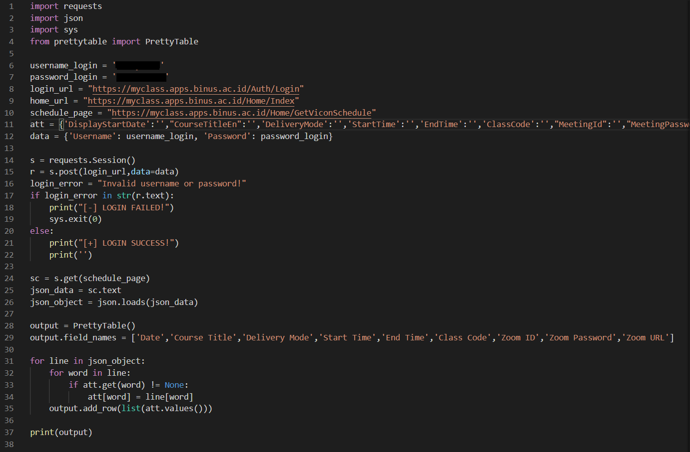

<html>
<head>
  
</head>
<body>
 

   <h1>liat_jadwal.py</h1>

<h2>Here is the full code.</h2>

<h3>I use 4 modules.</h3>
<h3>Requests module for http request.</h3>
<h3>Json module to process json data.</h3>
<h3>Sys module for exiting the program.</h3>
<h3>Prettytable module to print out the output in a table.</h3>
<h3>The script logs in to a website for Binus students to see their class schedule.</h3>
<h3>After it logs in, it gets the schedule data from "/Home/GetViconSchedule" in json format, process it using the json module and prints the columns that is in the "att" variable which is the columns that I really need.</h3>

</body>
</html>
