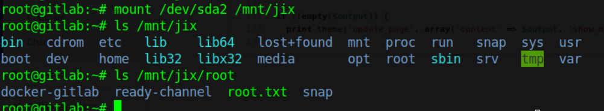

# Hackthebox - Ready

FIrst I run Nmap to scan for open ports.
Nmap result:

There is HTTP on port 5080, So I open the web page and got this page.

There is an admin directory based on robots.txt from the Nmap result. I try accessing it but just got an error saying that I need to sign in first.

So next I register an account and log in.

There is 1 public project on the server, so I try accessing it.

It looks like a web project using Drupal. But the files are not really hosted in a web server so I can't exploit the php files in the project.

Next I try enumerating the version of the Gitlab by accessing the **/help**, it tells us that it is version **11.4.7**.

It says that it needs to be updated ASAP. So there must be an exploit to this version of Gitlab. So I started searching and found an exploit (https://github.com/jas502n/gitlab-SSRF-redis-RCE) which leads to RCE.

I use Burpsuite to craft the payload. I command the server to curl to my machine.

I send the request and I got a hit to my machine.

After confirming the payload works, now I craft a payload for a reverse shell.

I setup a listener, send the request and got a reverse shell as the user git.

Next, I try running linpeas to enumerate for privilege escalation vectors. Linpeas tells me that I am in a docker container.

It also tells me there is a backup directory in /opt which is unusual.

Searching through the backup directory, I got a password from the **gitlab.rb** file.

I try switching to root and it worked.

But right now, i am just root in a docker container, so I run linpeas again for enumeration.

 Linpeas tells me that **/dev/sda** which is a hard disk is present, After researching a bit, I find an article (https://book.hacktricks.xyz/linux-unix/privilege-escalation/docker-breakout#i-own-root) that talks about how to break out of containers which also have /dev/sda present. So I follow the article and run the commands and got the root flag.
 
 
 If you want to get a root shell, you can take the SSH key of root
 
 
 Gives the key the proper permission.
 
 
 SSH into the box and got a shell as root.
 