<html>
  <head>
    
  </head>
  <body>

# **HACKTHEBOX – REMOTE WRITEUP**

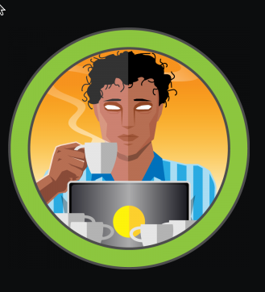

# **IP: 10.10.10.180**

# **ENUMERATION**

First, I run nmap to discover open ports.

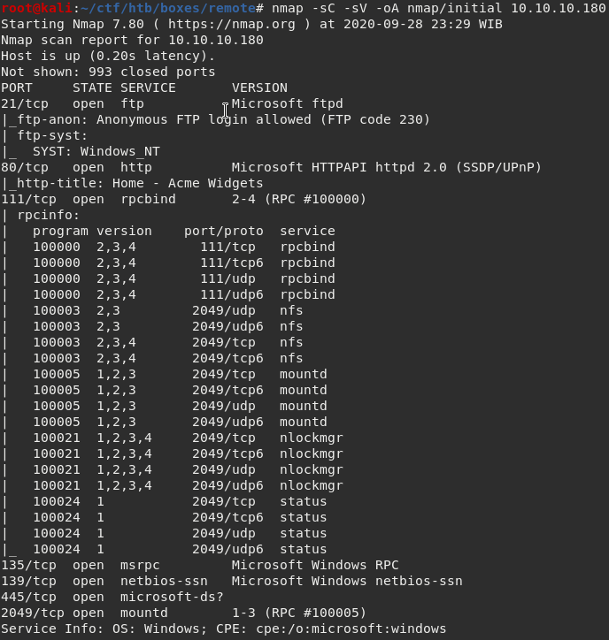

We have a bunch of open ports. I am going to start with ftp because it allows anonymous login.

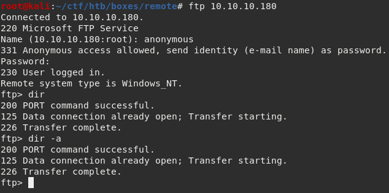

The ftp is empty so I am going to move on to SMB. I am going to use smbmap and smbclient.

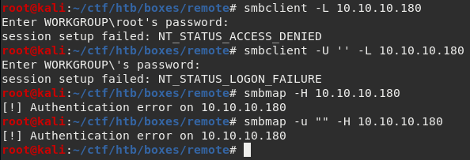

I can&#39;t list any shares and we don&#39;t have any credentials so I am going to move on to port 80.

I open the website, view the source and find out that the web is using umbraco which is a CMS using .NET.

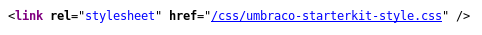

After clicking around, there is really nothing to do anymore so I am starting a gobuster.

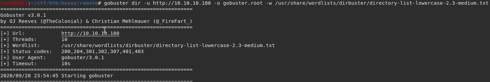

I use lower case wordlist because windows servers are not case sensitive.

# **FOOTHOLD**

Now I am going to leave the gobuster in the background and move on to NFS.

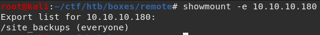

There is a folder called &quot;site\_backups&quot; which is interesting.

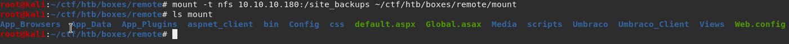

I mount the folder to my machine and got some files and folders.

There are quite many files and directories and looking at them 1 by 1 is time consuming, so I am googling things I could find, and I found this ([https://stackoverflow.com/questions/36979794/umbraco-database-connection-credentials](https://stackoverflow.com/questions/36979794/umbraco-database-connection-credentials)). Umbraco store their credentials on a &quot;.sdf&quot; file on App\_Data.

The sdf file has so much junk so I am going to use strings.

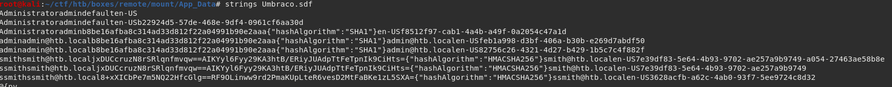

We got a credential. admin@htb.local with a SHA1 password. I am going to crackstation.net and the password is &quot;baconandcheese&quot;.

Then we just need to login to Umbraco. According to this ([https://our.umbraco.com/forum/getting-started/installing-umbraco/18792-Where-is-my-login-page](https://our.umbraco.com/forum/getting-started/installing-umbraco/18792-Where-is-my-login-page)), it is in &quot;/Umbraco&quot;.

I open the page and we got a login page.

Use the creds we got and logged in.

# **USER**

Clicking the help button on the bottom left gives us a version number which is 7.12.4, I am going to google the version if there is an exploit. There is an RCE exploit for the version. I am going to use the script from here ([https://www.exploit-db.com/exploits/46153](https://www.exploit-db.com/exploits/46153)) and modify it.

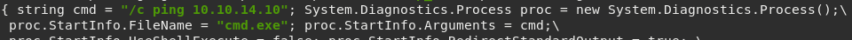

The &quot;cmd&quot; string is going to be the arguments for the &quot;FileName&quot; below it. I am using cmd.exe and tell it to ping to my box to make sure we got code execution.

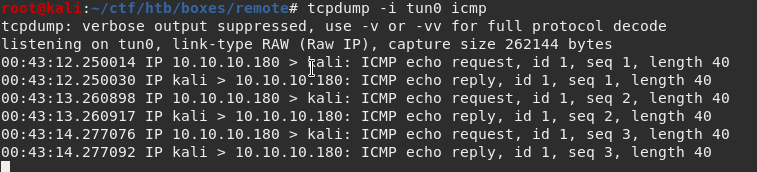

The box is pinging me which means we got code execution.

Now I am going to use nishang&#39;s &quot;Invoke-PowerShellTcp.ps1&quot; for my reverse shell.

Setup a listener on my machine, execute a command as powershell to download my reverse shell ps1 file and we got a shell!

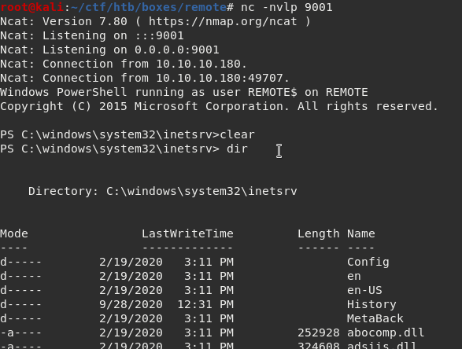

# **ROOT**

I am going to use winPEAS to scan the box for ways to escalate to root.

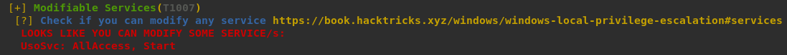

winPEAS.exe detected a service called &quot;UsoSvc&quot;, I am going with that.

According to the link given by the winPEAS ([https://book.hacktricks.xyz/windows/windows-local-privilege-escalation#services](https://book.hacktricks.xyz/windows/windows-local-privilege-escalation#services)), if a service has all access, we can modify the binary path that is executed by that service.

I use msfvenom to create a reverse shell executable.

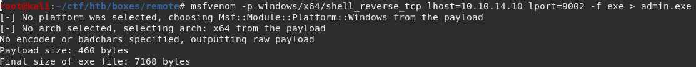

Use python to host a webserver, download the reverse shell executable to the target machine and exploit the &quot;UsoSvc&quot; service.

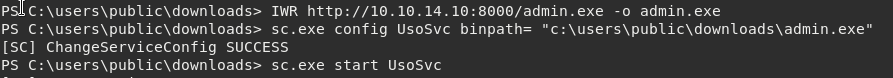

Setup a listener on my machine start the service and we got root!

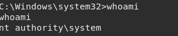

</body>
</html>
