# **Hackthebox - Scriptkiddie**

First I ran Nmap to scan for open ports.
Nmap result:
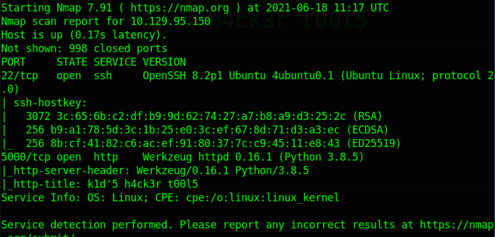

Port 5000 which is HTTP is open, So I open it using my browser and got to this page.
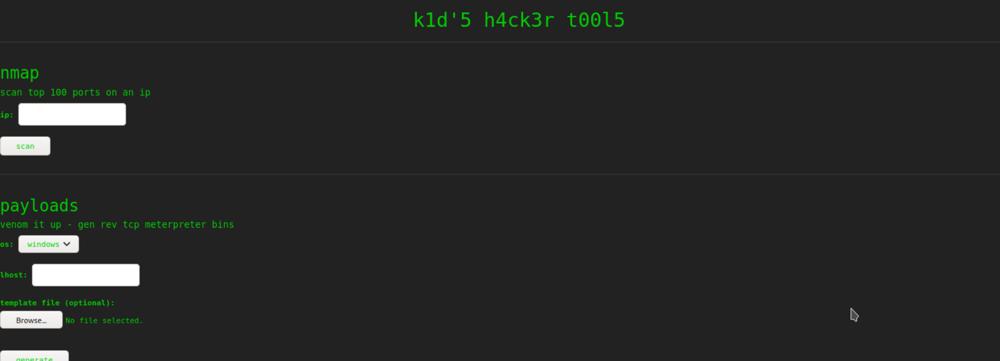

The website serves me 3 tools which is Nmap, MSFVenom and Searchsploit. I found a CVE(CVE-2020-7384) for MSFVenom which leads to command execution. I use a python script from https://github.com/justinsteven/advisories/blob/master/2020_metasploit_msfvenom_apk_template_cmdi.md for the exploit. 

Before I try to get a reverse shell, I check if the exploit works or not. I put a ping command to see if the box pings me back.
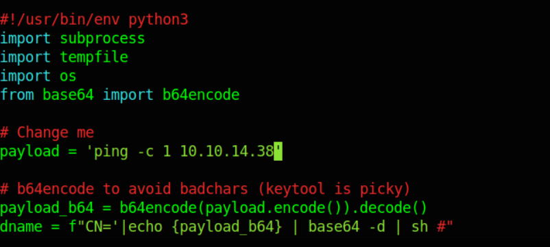

I use tcpdump to keep an eye on ICMP packets.
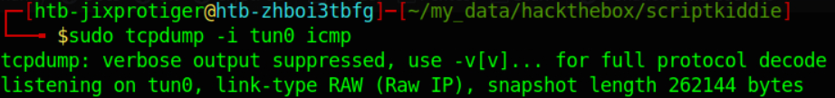

I got a ping back which means the exploit works!
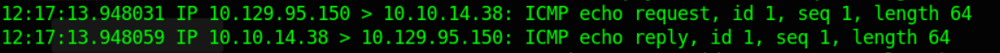

I created a bash script for my reverse shell.

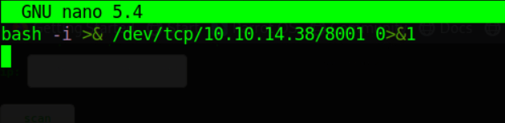

Change the payload command to curling my script and pipe it to bash.
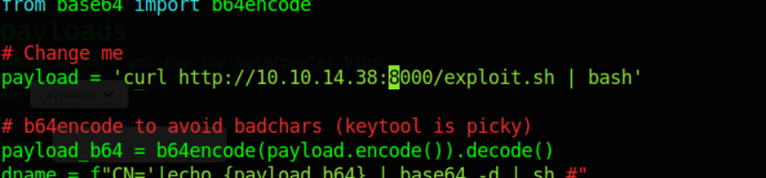

I ran the exploit and got a shell back.
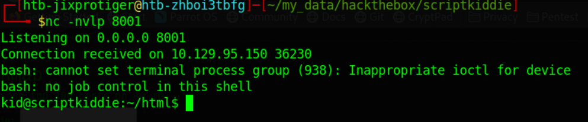

After getting a shell, I explore the files in the box and found an bash script in pwn's home directory.
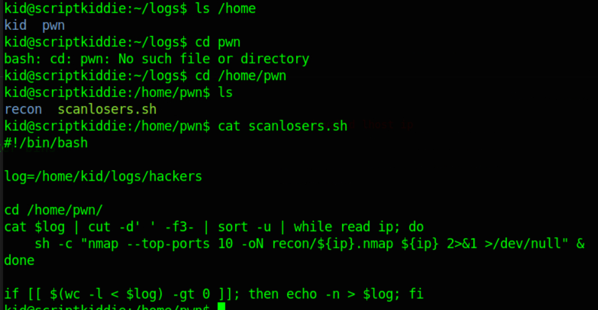

The script takes contents of the /home/kid/logs/hackers file, cut it and takes the third field and put it in the Nmap command. We can escape the Nmap command and put our own command and get command execution as the user pwn.
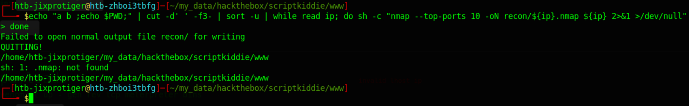

As you can see from the picturer above, the $PWD got printed twice everytime the ip variable is called which means we can execute arbitrary commands.

First i am going to test the exploit syntax to see if our command get executed on the box by curling my ptyon3 http server and see if it hits.
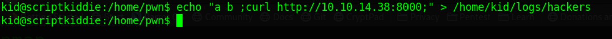

It curled the python3 server which means the syntax for the exploit is correct.
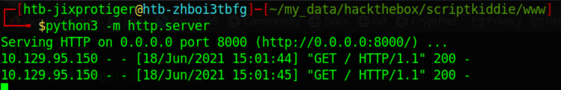

Now I can put a command for the reverse shell. I just use my rever shell bash script from just now and pipe it to bash and got the shell as pwn.
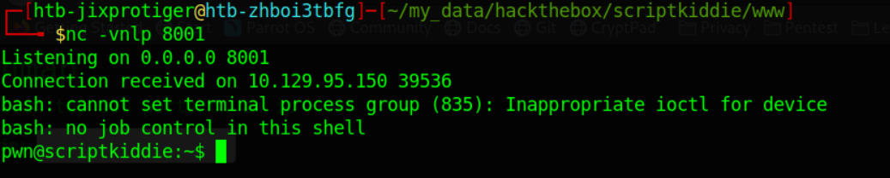

The user pwn can ran metsaploit as root.
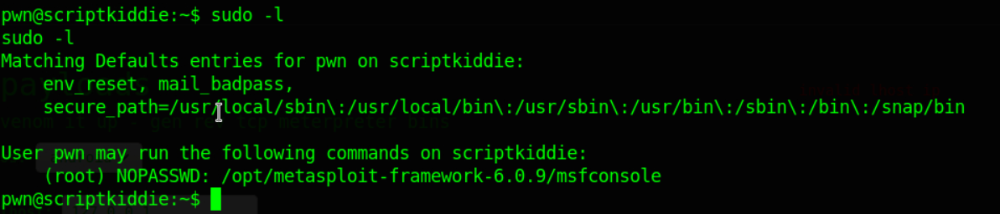

So I ran the metasploit as root.
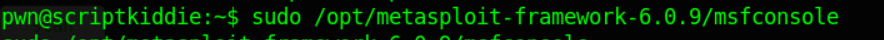

Execute bash from inside metasploit and got a shell as root.
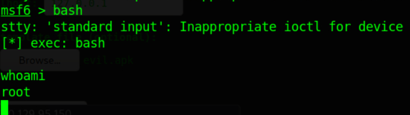

