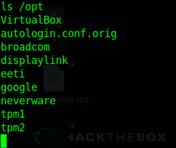

# Hackthebox - Spectra

First, I run nmap to scan for open ports.

There are 3 open ports, which is ssh, HTTP and MySQL. HTTP is more familiar to me and has a wider attack surface so I enumerate the HTTP web page first.

Upon opening the page, I got to this web page.

The links inside the page points to **spectra.htb**, so I added that name to my hosts file on "/etc/hosts".

Opening the "Software Issue tracker" link, I got into a Wordpress page.

When opening the "test" link, I just got this error.

I run wpscan to find informartion about the wordpress site.

Then I enumerate the testing page, and there is directory listing enabled on the directory. There is an interesting file called **wp-config.php.save**.

After viewing the content of the file, I got a credential for the database.

I tried to connect to MySQL on port 3306 with those credentials and it didn't work.

I also tried ssh but it also didn't work. So I go into the Wordpress login page, the devtest user doesn't work, but the user **administrator** with the password works and I was logged in to wp-admin.

After loggin in, I look back to wpscan and it tells us that the Wordpress version is outdated and is insecure.

I use metasploit to upload a shell and get a reverse shell as the user **nginx**.

Looking at the **/opt** directory, there is an interesting file called "autologin.conf.orig".

Looking at the content of the files, there is another insteresting directory called "/etc/autologin". Inside there is a file called passwd which contains a password.

Looking at /etc/passwd, there is another user called **katie**, I try to ssh in with that password for the user katie and I got the user flag.

The user katie can run a binary with sudo, which is very interesting.

After searching about this binary, this binary manages services in "/etc/init/". We can edit the service to run any command we want as root because we are using sudo. Running "sudo /sbin/initctl list" will list all the services. I chose to edit the test service and just give the root flag to katie's home directory.

Restart the service.

we got the root flag!

