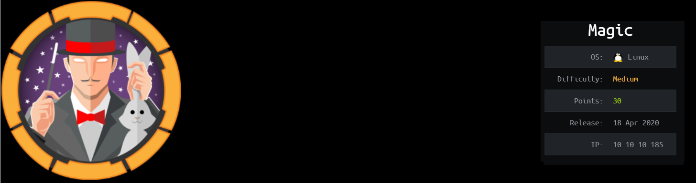
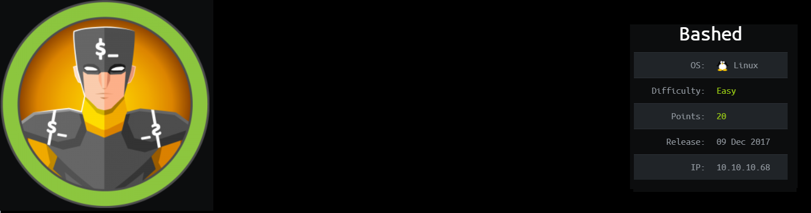

Hi, I am Denny Lee. I am a cyber security student in Bina Nusantara University. I like to do ctf especially Hackthebox and this is where I put my writeups.
 
<ul>
  <li><a href="https://dennylee22.github.io/Writeups/Magic/">HackTheBox - Magic</a></li>
  <li><a href="https://dennylee22.github.io/Writeups/Bashed/">HackTheBox - Bashed</a></li>
  <li><a href="https://dennylee22.github.io/Writeups/Optimum/">HackTheBox - Optimum</a></li>
  <li><a href="https://dennylee22.github.io/Writeups/Lame/">HackTheBox - Lame</a></li>
  <li><a href="https://dennylee22.github.io/Writeups/Remote/">HackTheBox - Remote</a></li>
  <li></li>
  <li></li>
</ul>
 
 

  

    <h2>Column 1</h2>
    
Some text..

  

  

    <h2>Column 2</h2>
    
Some text..

  

  

    <h2>Column 3</h2>
    
Some text..

  

  

    <h2>Column 4</h2>
    
Some text..

  

