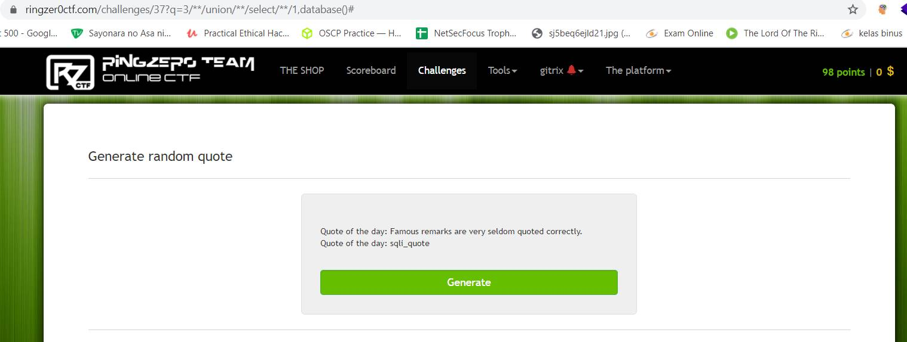
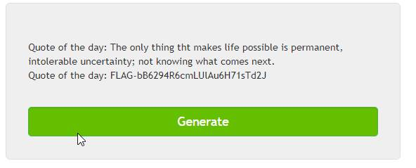

<html>
  <head>
    
  </head>
  <body>

## **RINGZER0CTF – &quot;QUOTE OF THE DAY&quot; WRITEUP**

## **Category: SQL Injection**

<a href="https://ringzer0ctf.com/challenges/37">## **LINK: https://ringzer0ctf.com/challenges/37**</a>

The webpage displays a button that says generate. When I click it, it shows a random quote.

The URL shows a GET parameter named &quot;q&quot;. When we change the value of &quot;q&quot;, the quote changes, which means &quot;q&quot; is the id of the displayed quotes.

Because the category of the challenge is SQL injection, I try to do a inject the &quot;q&quot; parameter with &quot;union select 1,2#&quot;. I use 2 columns because I assume that there are 2 columns in the database. A column id and a column for the quotes.

I got an error that says no result found, and it looks like all the spaces from the &quot;q&quot; parameter is removed. This is maybe to defend against basic SQL Injection.

We can get around this and use &quot;/\*\*/&quot; instead of spaces.

It displays the number 2, which means the injection worked and there are 2 columns in the table.

Now that we can inject the &quot;q&quot; parameter, we can do injections that outputs information from the database.

I replace 2 from my payload with database() to get the database name.

The database name is &quot;sqli\_quote&quot;.

I use this query: /\*\*/union/\*\*/select/\*\*/1,table\_name/\*\*/from/\*\*/information\_schema.tables/\*\*/where/\*\*/TABLE\_SCHEMA=database()#

This query is to display all tables that is inside the database &quot;sqli\_quote&quot; because that is what interesting to us, not tables from information\_schema.

It shows 2 tables. Table alkdjf4iu is very interesting, so that is what I am going to look at right now.

I use the query: /\*\*/union/\*\*/select/\*\*/id,flag/\*\*/from/\*\*/alkdjf4iu#

This query outputs all columns from the table alkdjf4iu, this will only work if the table has 2 columns.

And we got the flag!

</body>
</html>
